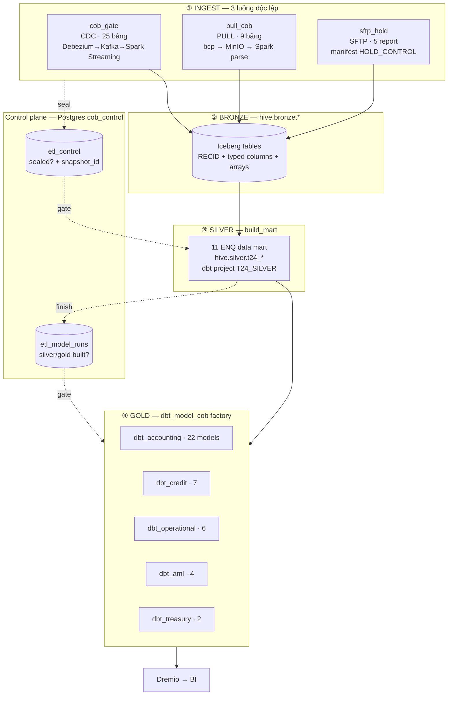

# BNCTL DWH — System Architecture (COB Pipeline v1.4)

Tài liệu này mô tả kiến trúc tầng **orchestration + transformation** của Data Warehouse BNCTL:
dữ liệu T24 core banking đi từ MSSQL/SFTP vào Hive Iceberg, được gate theo chu kỳ COB
(Close of Business), rồi build lên Silver data mart và Gold report.

> **Tầng hạ tầng** (Kubernetes, Helm, Kafka/Strimzi, MinIO, Dremio, Hive Metastore, Airflow,
> Jenkins, ELK) nằm ở repo riêng: **[dwh-deployments](https://github.com/phamthanhhai003/dwh-deployments)**.
> Repo này chỉ chứa DAG, dbt project, Spark job và parser library chạy *trên* stack đó.

---

## Mục lục

1. [Stack Overview](#stack-overview)
2. [Bài toán: tại sao cần COB gate](#bài-toán-tại-sao-cần-cob-gate)
3. [Kiến trúc 4 tầng](#kiến-trúc-4-tầng)
4. [Tầng INGEST — 3 luồng vào Bronze](#tầng-ingest--3-luồng-vào-bronze)
5. [Control plane — Postgres `cob_control`](#control-plane--postgres-cob_control)
6. [Cơ chế gate & snapshot pinning](#cơ-chế-gate--snapshot-pinning)
7. [Tầng BUILD — Silver ENQ → Gold division](#tầng-build--silver-enq--gold-division)
8. [`t24_parser` — metadata-driven XMLRECORD parser](#t24_parser--metadata-driven-xmlrecord-parser)
9. [DAG inventory](#dag-inventory)
10. [Extension points (config-driven)](#extension-points-config-driven)
11. [Performance baseline](#performance-baseline)
12. [CI/CD](#cicd)
13. [Known gaps](#known-gaps)

---

## Stack Overview

```
                        ┌──────────────── T24 core banking (MSSQL) ────────────────┐
                        │                                                            │
              CDC (24/7)│                        PULL (sau COB)                      │ marker
                        ▼                                 ▼                          ▼
             Debezium → Kafka (Strimzi KRaft)      bcp / JDBC extract        t24_batch
                        │                                 │                  PROCESS.STATUS
                        ▼                                 ▼                          │
              Spark Structured Streaming        MinIO s3a://raw/t24/<T>/<D>/          │
              foreachBatch → parse()                      │                           │
                        │                                 ▼                           │
                        │                        Spark batch parse()                  │
                        │                                 │                           │
    SFTP HOLD ──────────┼─────────────────────────────────┤                           │
    (CRF/CRB/CRC)       │      manifest-driven fetch      │                           │
                        ▼                                 ▼                           │
                 ╔══════════════════════════════════════════════╗                     │
                 ║   BRONZE — hive.bronze.*  (Iceberg / MinIO)   ║                     │
                 ╚══════════════════════════════════════════════╝                     │
                                        │                                             │
                        ┌───────────────┴───────────────┐                             │
                        │   cob_gate  ◄─────────────────┼─────────────────────────────┘
                        │   seal + pin snapshot_id      │
                        │   → Postgres etl_control      │
                        └───────────────┬───────────────┘
                                        ▼
                 ╔══════════════════════════════════════════════╗
                 ║   SILVER — hive.silver.t24_*  (11 ENQ mart)  ║   dbt · T24_SILVER
                 ╚══════════════════════════════════════════════╝
                                        ▼
                 ╔══════════════════════════════════════════════╗
                 ║   GOLD — hive.gold.*  (41 report models)     ║   dbt · T24_<DIVISION>
                 ╚══════════════════════════════════════════════╝
                                        ▼
                              Dremio (query engine) → BI
```

| Layer | Công nghệ | Vai trò trong repo này |
|---|---|---|
| Orchestration | Apache Airflow 3.0.2 | 14 DAG object từ 9 file (`dags/`) |
| Streaming | Spark 3.5.1 Structured Streaming + Kafka | `jobs/t24_streaming_cdc.py` |
| Batch compute | Spark on Kubernetes (Spark Operator) | `jobs/`, `scripts/parser/`, `spark-app/*.yaml` |
| Bulk extract | `bcp` (TDS Bulk Copy) + pyarrow | `jobs/t24_bcp_extract.py` |
| Table format | Apache Iceberg trên MinIO (S3A), Hive Metastore catalog | `hive.bronze/silver/gold` |
| Transformation | dbt + `dbt-dremio` adapter | 6 dbt project |
| Query engine | Dremio (REST API) | `dags/lib/dremio.py` |
| Control plane | PostgreSQL | `scripts/cob_pipeline/01_postgres_control_tables.sql` |
| CDC | Debezium SQL Server connector trên Kafka Connect | `kafka/` |
| CI/CD | Jenkins + Kaniko | `dev.Jenkinsfile`, `uat.Jenkinsfile` |

---

## Bài toán: tại sao cần COB gate

T24 chạy COB (Close of Business) mỗi đêm. Trong lúc COB chạy, bảng nghiệp vụ **vẫn đang biến
động** — CDC stream tiếp tục nhận event. Nếu dbt model đọc Bronze ở thời điểm tuỳ ý thì mỗi lần
chạy ra một kết quả khác nhau: báo cáo ngày D có thể lẫn giao dịch ngày D+1.

Kiến trúc này giải quyết bằng 3 nguyên tắc:

1. **Một nguồn sự thật cho ngày D.** `business_date` KHÔNG suy từ lịch Airflow. Nó đọc từ marker
   T24 thật: record `BNK/COB.INITIALISE` trong `hive.bronze.t24_batch`, khi `process_status = 0`
   ⟹ COB xong. Toàn bộ DAG gọi chung `dags/lib/cob_marker.py` — sửa rule chỉ ở 1 chỗ.

2. **Seal trước, đọc sau.** Nguồn nào xong cho ngày D thì ghi `sealed` vào Postgres `etl_control`.
   Model chỉ chạy khi *đúng source-set của nó* đã sealed — không chờ thừa, không chạy sớm.

3. **Ghim snapshot thay vì khoá bảng.** Với luồng CDC, lúc seal ta ghim `iceberg_snapshot_id`.
   dbt model đọc `FROM hive.bronze.t24_account AT SNAPSHOT '{{ var("snap_account") }}'`
   → kết quả **tái lập được** (reproducible), CDC vẫn ghi tiếp mà không ảnh hưởng báo cáo.

> ⚠️ Dremio KHÔNG đọc được named tag trên Hive catalog → phải ghim bằng `snapshot_id` dạng số.

---

## Kiến trúc 4 tầng



| Tầng | Schema | Materialization | Ai build | Gate điều kiện |
|---|---|---|---|---|
| Bronze | `hive.bronze` | Iceberg, MERGE (CDC) / append (pull, sftp) | Spark | — |
| Silver | `hive.silver` | `table`, rebuild mỗi COB | `build_mart` (dbt `T24_SILVER`) | `all_sealed(source_set(ENQ))` |
| Gold | `hive.gold` | `table --full-refresh`, snapshot ngày D | `dbt_model_cob` factory | `all_enqs_built(division)` |

> Gold là **current-state snapshot của ngày D**, KHÔNG tích luỹ history → rebuild full mỗi COB.
> Chọn `--full-refresh` cũng để tránh bug incremental MERGE của dbt-dremio (model `sms_alert`:
> `account_id` không tồn tại trong `DBT_INTERNAL_SOURCE` temp table).

---

## Tầng INGEST — 3 luồng vào Bronze

Ba luồng chạy **song song và độc lập**, chỉ gặp nhau ở `etl_control`. Không luồng nào gọi luồng
kia — downstream tự đọc control table.

### Luồng 1 — CDC (25 bảng, chạy 24/7)

```
MSSQL ── Debezium ──► Kafka topic/bảng ──► Spark Structured Streaming (1 SparkApplication)
                                                    │
                                        foreachBatch(micro-batch):
                                          latest_per_recid(LSN)
                                            → split deletes / upserts
                                            → parse(upserts)          ← CÙNG hàm với batch
                                            → MERGE bronze + replace children
                                            → apply deletes
                                            → errors → DLQ
                                            → upsert max(__lsn) → etl_stream_progress
```

Mọi sink step **idempotent** ⟹ checkpoint replay sau restart là an toàn.

`cob_gate` gate luồng này bằng 2 nhánh, bảng nào thoả 1 trong 2 là `caught_up`:

| Nhánh | Điều kiện | Dùng cho |
|---|---|---|
| A | `etl_stream_progress.max_lsn[T] >= L_cob` | Bảng có event trong phiên COB |
| B | `stream_lsn >= L_cob` **AND** `kafka_lag(topic) = 0` | Bảng IM/rỗng — không có event nên `max_lsn` không nhích, nhánh A sẽ treo vô hạn |

Nhánh B tính lag ngoài Spark (`dags/lib/kafka_lag.py`): so `kafka_end_offsets` với offset Spark đã
commit đọc từ checkpoint trên MinIO — vì Spark cluster mode không expose `lastProgress` cho Python.

Sau khi tất cả `caught_up` → `pin_and_seal`: ghim `iceberg_snapshot_id` từng bảng, `seal(flow='cdc')`.

### Luồng 2 — PULL (9 bảng reference, sau COB)

Bảng reference/lookup (`company`, `category`, `transaction`, `eb_lookup`, …) không cần CDC —
full snapshot mỗi ngày rẻ hơn và đơn giản hơn.

```
get_business_date (marker COB → D, open_pending N bảng)
 ├─ FBNK_SECTOR   : extract ──► parse ──► reconcile_seal
 ├─ F_COMPANY     : extract ──► parse ──► reconcile_seal
 └─ ... fan-out per bảng (song song, cô lập lỗi)
```

- **extract** = `bcp queryout` chạy trong KubernetesPodOperator (plain pod, KHÔNG Spark).
  BCP mở 1 connection TDS, SQL Server sequential-scan và push stream liên tục; client parse TSV
  bằng pyarrow, mỗi 500K rows ghi 1 Parquet chunk (~250 MB RAM) upload thẳng MinIO — không chạm
  disk local.
- **parse** = SparkApplication đọc Parquet đó → `t24_parser.parse()` → Bronze, stamp `business_date`.
- **seal** = Dremio refresh metadata → `count(*)` → so với `expected` → `seal(flow='pull')`.

> Chọn bcp thay Spark JDBC: **~25s vs ~68s / 100K rows**, và 0 executor pod thay vì 2.
> Đánh đổi: bcp giữ shared lock trong lúc scan. Chi tiết: [`BCP_vs_JDBC_deep_dive.html`](BCP_vs_JDBC_deep_dive.html).

### Luồng 3 — SFTP HOLD (5 report CRF/CRB/CRC)

File báo cáo native T24 (GL/PL trial balance, CRB deposits) do COB sinh ra và đổ vào một thư mục
HOLD **phẳng** trên Windows Server. Vấn đề: thư mục chứa hàng nghìn file của nhiều ngày.

Giải pháp **manifest-driven** — không quét thư mục:

```
bảng T24 HOLD_CONTROL ──CDC──► hive.bronze.hold_control   (= manifest RECID → report/branch/COB)
                                        │
        query WHERE date_created = D ───┤
                                        ▼
                          manifest JSON → MinIO s3a://.../manifests/sftp_hold/<report>/<D>.json
                                        ▼
                       Spark fetch ĐÚNG các RECID đó từ HOLD → MinIO raw
                                        ▼
                              parse → hive.bronze.crf_bnctlgl / crb_bnctlgl / ...
                                        ▼
                                    seal(flow='sftp')
```

Trigger = COB-done, **không cần file-arrival sensor**: COB xong ⟹ T24 đã export hết file.
Manifest có RECID mà HOLD không có file (bị purge) → fetch FAIL ngay, không âm thầm thiếu dữ liệu.

---

## Control plane — Postgres `cob_control`

DDL: [`scripts/cob_pipeline/01_postgres_control_tables.sql`](../scripts/cob_pipeline/01_postgres_control_tables.sql)
(idempotent, chạy được nhiều lần). API Python: `dags/lib/etl_control.py`.

| Bảng | PK | Vai trò |
|---|---|---|
| `etl_stream_progress` | `table_name` | Spark foreachBatch upsert `max_lsn` mỗi micro-batch + row `__global__` = `stream_lsn`. Cột `committed_offsets` (jsonb) cho lag nhánh B. |
| `etl_control` | `(business_date, source_table)` | Gate INGEST. `flow ∈ (cdc, pull, sftp)`, `status ∈ (pending, sealed, failed)`. CDC seal kèm `iceberg_snapshot_id`; pull/sftp seal kèm `expected_count`/`actual_count`. |
| `etl_model_runs` | `(domain, enq_name, layer, business_date)` | Gate BUILD. `layer='silver'` → 1 row/ENQ; `layer='gold'` → `enq_name=''`, `domain` = division. |
| `etl_ingest_logs` | `(source_name, flow, business_date)` | Tracking 2 nhịp `is_sync` / `is_parsed` cho pull + sftp. CDC không có (streaming, không có sync step riêng). |

Hàm gate chính:

```python
ctl.all_sealed(pg, D, sources)            # mọi source trong list đã sealed cho D?
ctl.sealed_snapshots(pg, D, cdc_sources)  # {source: snapshot_id} để bơm vào dbt --vars
ctl.all_enqs_built(pg, domain, enqs, D)   # mọi silver ENQ của division đã success?
ctl.is_model_built(pg, domain, D)         # idempotent guard: gold đã build rồi?
```

---

## Cơ chế gate & snapshot pinning

Mỗi DAG BUILD đi qua đúng 6 bước:

```
detect_d ──► wait_gate ──► skip_if_built ──► prepare_vars ──► dbt run ──► finish
(sensor)     (sensor)      (idempotent)      (inject vars)                (ghi etl_model_runs)
```

- `detect_d` và `wait_gate` là `PythonSensor(mode="reschedule")` — nhả worker slot giữa các lần
  poke, không giữ pod. `poke_interval` 60–120s, `timeout` 4–6h.
- `skip_if_built` raise `AirflowSkipException` nếu `is_model_built(domain, D)` — chạy lại DAG cho
  cùng D là no-op.
- **Replay/debug**: trigger với `conf {"business_date": "2026-06-25"}` → `cob_marker.conf_override`
  bỏ qua marker COB shared và bỏ cả 2 lớp idempotent guard để ép build lại.

`prepare_vars` bơm biến vào dbt:

```jsonc
{
  "business_date": "2026-06-25",
  "target_date":   "2026-06-25",
  "snap_account":  "7215384021...",   // chỉ bronze mode: 1 var per CDC source
  "snap_customer": "9182736450..."
}
```

Model dùng nguồn theo **loại bảng** — đây là quyết định thiết kế cốt lõi của tầng Silver:

| Loại | Cách đọc | Lý do |
|---|---|---|
| `cdc_dim` (current-state: account, customer, …) | `FROM hive.bronze.t24_x AT SNAPSHOT '{{ var("snap_x") }}'` | Cần trạng thái *tại* thời điểm COB, không phải "mới nhất" |
| `cdc_event` (transaction: stmt_entry, …) | `WHERE booking_date = date '{{ var("business_date") }}'` | Event có ngày riêng, lọc theo ngày là đủ |
| `pull` | `WHERE business_date = date '{{ var("business_date") }}'` | Full snapshot stamp ngày D |
| `sftp` | `WHERE business_date = date '{{ var("business_date") }}'` | File COB stamp ngày D |

---

## Tầng BUILD — Silver ENQ → Gold division

### Silver: 11 ENQ data mart

`dags/lib/enq_sources.py` là **single source of truth** map ENQ → source-set:

```python
"t24_daily_txn_9k": {
    "division":  "aml",
    "cdc_dim":   ["account", "customer", "acct_activity", "teller"],
    "cdc_event": [("stmt_entry", "booking_date")],
    "pull":      ["transaction", "eb_lookup", "gic_id", "company"],
}
```

Từ đó derive tự động:
- `cdc_union()` → **25 bảng** CDC mà `cob_gate` phải gate + pin
- `pull_union()` → **9 bảng** pull mà `pull_cob` phải extract
- `source_set(enq)` → danh sách bronze mà gate của ENQ đó phải chờ
- `enqs_for_division(d)` → ENQ nào thuộc division nào

Module có `_validate()` chống lệch classification: bảng khai `cdc_*` không được nằm trong
`PULL_TABLES` và ngược lại. Chạy `python dags/lib/enq_sources.py` để check.

`build_mart` là **1 DAG fan-out 11 nhánh** (không phải 11 DAG): 1 sensor COB + gate chung, rồi mỗi
ENQ có nhánh `prepare_vars → dbt_run --select <enq> → finish_enq_run` riêng — vẫn giữ granularity
per-ENQ (ghi `etl_model_runs` riêng, skip-if-built riêng) mà gọn hơn factory 11 DAG.
`max_active_tasks=4` throttle số dbt build song song để không dìm Dremio.

| Division | Silver ENQ |
|---|---|
| operational | `t24_acct_cust`, `t24_ac_gic_close` |
| aml | `t24_inactive_account_report`, `t24_no_legal_doc_cus_report`, `t24_daily_txn_9k`, `t24_e_account_open` |
| credit | `t24_cris_report`, `t24_find_arrangement_al_bnctl`, `t24_aa_wof_loans_report` |
| treasury | `t24_ft_inremit` |
| accounting | `trial_balance_detail` (nguồn SFTP: `crf_bnctlgl` + `crf_bnctlpl`) |

### Gold: factory 6 DAG từ `DOMAIN_CONFIGS`

`dags/dbt_model_cob_dag.py` sinh 1 DAG per entry trong list `DOMAIN_CONFIGS`. Hai chế độ gate:

**Silver mode** (`enq_names ≠ []`) — dùng cho 5 division production:

```python
{
    "domain": "accounting", "dag_id": "dbt_accounting", "dbt_dir": "T24_ACCOUNTING",
    "dbt_select": "t24_accounting",                       # cả package
    "models_built": 22,
    "enq_names": ["trial_balance_detail"],
    "extra_enqs": [("credit", "t24_cris_report")],        # silver ENQ CHÉO division
    "direct_bronze_sources": ["hive.bronze.crb_bnctlgl"], # bronze đọc thẳng, bỏ qua silver
}
```

**Bronze mode** (`enq_names = []`) — model đọc thẳng Bronze `AT SNAPSHOT`, dùng cho `dbt_demo`
(project `COB_TEST`) làm case E2E test khó nhất: mix cả 3 luồng CDC + pull + sftp.

| DAG | dbt project | Models | Gate |
|---|---|---|---|
| `dbt_accounting` | `T24_ACCOUNTING` | 22 (+10 seed CSV) | silver `trial_balance_detail` + cross-division `credit.t24_cris_report` + bronze `crb_bnctlgl` |
| `dbt_credit` | `T24_CREDIT` | 7 | 3 silver ENQ |
| `dbt_operational` | `T24_OPERATIONAL` | 6 | 2 silver ENQ |
| `dbt_aml` | `T24_AML` | 4 | 4 silver ENQ |
| `dbt_treasury` | `T24_TREASURY` | 2 | 1 silver ENQ |
| `dbt_demo` | `COB_TEST` | 1 | bronze mode: 2 CDC + 1 pull + 1 sftp |

`dbt_run` copy project sang `/tmp/<domain>_run` rồi chạy ở đó — tránh 2 DAG ghi đè `target/` của
nhau. `dbt deps` chỉ chạy khi project có `packages.yml`; `dbt seed` best-effort (`|| true`) vì
dbt-dremio không drop seed khi `--full-refresh`, môi trường đã seed rồi sẽ báo "already exists".

---

## `t24_parser` — metadata-driven XMLRECORD parser

Bảng T24 lưu dữ liệu dạng `(RECID, XMLRECORD)` — toàn bộ nghiệp vụ nằm trong 1 cột XML dialect
riêng của T24, có multi-value và sub-value. Viết parser tay cho ~60 bảng là không khả thi.

`libs/t24_parser/` giải quyết bằng cách đọc chính metadata của T24: bảng `STANDARD.SELECTION`
(bản thân nó cũng là XMLRECORD cùng dialect) mô tả field layout của mọi bảng.

```
STANDARD.SELECTION (XMLRECORD)  ──build_spec()──►  TableSpec
                                                       │
                              DataFrame(RECID, XMLRECORD) ──parse(df, spec)──► ParsedFrames
```

Layout đã decode (validated 2026-06-11 với export thật của BNCTL):

| mv | Field | Ý nghĩa |
|---|---|---|
| c1 | `SYS.FIELD.NAME` | tên field (`@ID` = RECID) |
| c2 | `SYS.TYPE` | `D` = data field thật (parse); `I`/`C` = computed/join (skip) |
| c3 | `SYS.FIELD.NO` | vị trí N → `<cN>` trong XMLRECORD data |
| c4 | `SYS.VAL.PROG` | IN2 conversion → suy type: `IN2D` = date yyyyMMdd, `IN2AMT` = decimal |
| c10 | `SYS.SINGLE.MULT` | `S` single / `M` multi-value |
| c15–c18 | USR block | LOCAL.REF custom field, đánh mv riêng |

Output `ParsedFrames`:

| Frame | Nội dung |
|---|---|
| `main` | 1 row/RECID — scalar columns typed + LOCAL.REF columns + multi-value → **ARRAY dense theo mv_no** (element i = value tại mv=i+1, null nếu thiếu — T24 associated multi-value align theo index nên bắt buộc pad) |
| `sv_long` | Sub-value hiếm (sv > 1, chủ yếu trong LOCAL.REF) → `(recid, field, pos, mv_no, sv_no, value)` — lossless spillover |
| `errors` | Record tokenize fail → route DLQ |

Hai tính chất quan trọng:

1. **`parse()` là pure transform, không I/O, không biết streaming hay batch.** Đúng một hàm đó
   chạy ở cả 2 đường:
   ```python
   batch:     parse(spark.read.parquet(...), spec)
   streaming: stream.writeStream.foreachBatch(lambda df, _: sink(parse(df, spec)))
   ```
   → CDC và pull không thể lệch schema.

2. **Không `explode`/`groupBy` trên main path** — toàn bộ dựng bằng Spark higher-order functions
   trên mảng token đã tách, nên không có shuffle.

21 unit test (`libs/t24_parser/tests/`), trong đó nhóm `@pytest.mark.spark` cần SparkSession nên
chạy trong image Spark / trên cluster.

---

## DAG inventory

Tất cả DAG đều `schedule=None` (production sẽ gắn cron cho `cob_gate`; các DAG khác neo theo
marker COB chứ không theo lịch) và `max_active_runs=1`.

| DAG | Tầng | Vai trò |
|---|---|---|
| `cob_gate` | INGEST | Sensor COB-done → `wait_caught_up` 25 bảng CDC → pin snapshot → seal. "Nguồn D duy nhất". |
| `pull_cob` | INGEST | bcp extract 9 bảng pull → parse → reconcile seal. |
| `sftp_hold` | INGEST | Manifest-driven fetch 5 report CRF/CRB/CRC → parse → seal. |
| `build_mart` | BUILD | Fan-out build 11 silver ENQ → `hive.silver.t24_*`. |
| `dbt_accounting` `dbt_credit` `dbt_operational` `dbt_aml` `dbt_treasury` `dbt_demo` | BUILD | Factory từ `DOMAIN_CONFIGS` → `hive.gold.*`. |
| `pull_bulk` | OPS | BCP bulk extract 36 bảng CDC (Day-1 init load / benchmark) → `hive.test.*`. |
| `pull_bulk_fresh` | OPS | BCP full snapshot 22 bảng reference → `hive.test.*`. |
| `pull_jdbc` | OPS | Cùng logic `pull_cob` nhưng extract bằng Spark JDBC — dùng để benchmark đối chứng với BCP. |
| `t24_pull_pipeline` | OPS | JDBC pull full snapshot, manual trigger — initial load / recovery. |

> ⚠️ **1 bảng = 1 nguồn.** `t24_pull_pipeline` (recovery thủ công) cũng list `FBNK_SECTOR` /
> `FBNK_INDUSTRY`. ĐỪNG chạy nó cho bảng mà `pull_cob` đang sở hữu — sẽ double-ingest.

---

## Extension points (config-driven)

Thiết kế để thêm nghiệp vụ mới **không sửa DAG code**:

| Muốn thêm | Sửa đúng 1 chỗ |
|---|---|
| Silver ENQ mới | 1 entry vào `dags/lib/enq_sources.ENQ_SOURCES` + 1 file `.sql` trong `T24_SILVER/models/` |
| Gold report / division mới | 1 dict vào `dags/dbt_model_cob_dag.DOMAIN_CONFIGS` + dbt project |
| Bảng pull mới | append vào `pull_cob.TABLES` (điều kiện: bảng có trong source DB + SS key có trong `ss_full.json`) |
| Bảng CDC mới | append vào `cob_gate.CDC_SOURCES` — ⚠️ gate sẽ CHỜ bảng đó `caught_up`, seed test phải bump LSN của nó, nếu không sensor chờ vô hạn |
| Report SFTP mới | 1 entry `REPORTS` trong `sftp_hold_dag.py` |

Hướng dẫn từng bước: [`ADD_DBT_MODEL_TO_COB.md`](ADD_DBT_MODEL_TO_COB.md).

---

## Performance baseline

Số liệu **đo thật**, không phải ước lượng. Chi tiết đầy đủ trong các report kèm theo.

### BCP vs Spark JDBC (extract 100K rows)

| | BCP | Spark JDBC |
|---|---|---|
| Thời gian | **~25s** | ~68s |
| Protocol | TDS Bulk Copy (native) | JDBC generic |
| Connection | 1, stream liên tục | N song song theo partition |
| Executor pod | **0** (1 pod: 1 core / 2GB) | 2 |
| Query planner | bypass | plan × N partitions |
| Đánh đổi | giữ shared lock khi scan | không giữ lock lâu |

→ [`BCP_vs_JDBC_deep_dive.html`](BCP_vs_JDBC_deep_dive.html)

### `pull_bulk` — 36 bảng CDC, DEV (cap 100K rows/bảng)

Spark parse: 2 executor × 2 cores × 2g, driver 1g, `shuffle.partitions=4`.
Pool: extract 4 slots · parse 5 slots · seal 7 slots.

| Bảng | Rows | Size est (MB) | Extract (s) | Parse (s) | Seal (s) |
|---|---:|---:|---:|---:|---:|
| AAFBNK_AA010 (AA.ACTIVITY.HISTORY) | 100,000 | 4,361 | 360 | 4,517 | 11 |
| FBNK_ACCOUNT | 100,000 | 1,849 | 331 | 3,744 | 10 |
| FBNK_AA_ACCOUNT_DETAILS | 100,000 | 1,026 | 177 | 1,281 | 11 |
| FBNK_PV_ASSET_DETAIL | 100,000 | 808 | 101 | 1,228 | 10 |
| FBNK_CUSTOMER | 100,000 | 496 | 24 | 1,492 | 10 |
| FBNK_STMT_ENTRY | 100,000 | 184 | 15 | 229 | 11 |

Bottleneck rõ ràng là **parse**, không phải extract — chi phối bởi XML size/row
(AAFBNK_AA010 ~11KB/row) và `shuffle.partitions=4`.

### `pull_bulk` — UAT (full data, HDD)

| Bảng | Rows | Size (GB) | Extract | Parse |
|---|---:|---:|---|---|
| FBNK_AA_PROCESS_DETAILS | 22,815,444 | 46.11 | ~93m | — |
| FBNK_ACCOUNT | 699,343 | 12.93 | 1,626s (~27m) | — |
| FBNK_CUSTOMER | 619,395 | 3.00 | 1,391s (~23m) | 5,919s (~1h38m) |
| FBNK_AA_BILL_DETAILS | 583,163 | 3.35 | 1,402s (~23m) | 2,683s (~44m) |

→ [`BCP_PIPELINE_REPORT.html`](BCP_PIPELINE_REPORT.html) · [`BCP_PIPELINE_TRACKING.md`](BCP_PIPELINE_TRACKING.md)

### `pull_bulk_fresh` — 22 bảng reference, DEV (full data)

**21/22 thành công, wall time ~10m24s.** Extract chỉ 10–13s/bảng (data nhỏ); parse 75–310s vì
Spark submit + driver/executor startup overhead chiếm ~60–70s **ngay cả với bảng 0 rows**.

`F_PL_CLOSE_DATES` fail: `KeyError: table 'PL.CLOSE.DATES' not found in STANDARD.SELECTION` —
thiếu schema trong `ss_full.json`.

→ [`BCP_FRESH_PIPELINE_REPORT.html`](BCP_FRESH_PIPELINE_REPORT.html)

### Phân loại bảng theo kích thước (dev est @ 100K rows)

| Type | Ngưỡng | Số bảng |
|---|---|---:|
| Type 3 — Large | > 200 MB | 6 |
| Type 2 — Medium | 20–200 MB | 17 |
| Type 1 — Small | < 20 MB | còn lại |

→ [`CDC_TABLE_CLASSIFICATION.md`](CDC_TABLE_CLASSIFICATION.md)

### Day-1 init load (ước tính PROD)

Tổng **300–500M rows, ~700GB–1TB raw XML**. 5 bảng giao dịch lớn nhất chiếm phần lớn:
`FBNK_STMT_ENTRY_DETAIL` (~173 GB), `FBNK_STMT_ENTRY` (~168 GB), `FBNK_CATEG_ENTRY` (~145 GB),
`FBNK_CATEG_ENTRY_DETAIL` (~133 GB), `FBNK_AA_PROCESS_DETAILS` (~35 GB).

→ [`DAY1_INIT_LOAD_PLANNING.md`](DAY1_INIT_LOAD_PLANNING.md)

---

## CI/CD

`dev.Jenkinsfile` / `uat.Jenkinsfile`:

```
Prepare ──► dbt Lint ──► Build & Push Image ──► Deploy Image
                         (Kaniko trong K8s pod,   (kubectl set image scheduler /
                          cache-repo riêng)        dag-processor / api-server /
                                                   triggerer + rollout status)
```

- **dbt Lint** chạy `dbt parse` cho từng project để bắt lỗi Jinja/ref trước khi build image.
- **Build** dùng Kaniko (không cần Docker daemon trong cluster), tag `airflow-build-${BUILD_NUMBER}`.
- **Deploy** patch cả `airflow.cfg` (`worker_container_repository` / `worker_container_tag`) và
  `jenkins/pod_template_file.yaml` để KubernetesExecutor worker dùng đúng image mới.

Hai image:

| Image | Dockerfile | Nội dung |
|---|---|---|
| `<repo>/dwh-test:airflow-build-N` | `Dockerfile` | Airflow + dbt-dremio + `kafka-python`, bake cả repo vào `/opt/airflow/dags/repo/` |
| `<repo>/spark-t24:<tag>` | `spark/Dockerfile.t24` | Spark 3.5.1 + jars (Kafka, MSSQL JDBC — tải từ Maven lúc build) + `t24_parser` + `mssql-tools` (bcp) + pyarrow + entrypoints |

---

## Known gaps

Ghi lại thẳng để người đọc code không mất thời gian đi tìm:

| Gap | Ảnh hưởng |
|---|---|
| `scripts/sync/sftp_sync_spark.py` không có trong repo | `spark-app/sync/sftp_sync_spark.yaml` trỏ `local:///opt/jobs/sftp_sync_spark.py` — script hiện chỉ tồn tại trong image đã build. `sftp_hold` không chạy được nếu build image từ repo sạch. |
| `F_PL_CLOSE_DATES` thiếu trong `ss_full.json` | 1/22 bảng reference parse fail. |
| `t24_ft_inremit` date_col chưa chốt | Silver treasury đang đọc `funds_transfer` dạng snapshot, date slicing đẩy xuống gold. |
| `dags/lib/t24_sources.py` có `CDC_TABLES` stale (19 bảng) | KHÔNG dùng làm nguồn phân loại. Authoritative là `enq_sources.py` (25 CDC / 9 pull). |
| `T24_SILVER/models/` có 15 file `.sql` nhưng `ENQ_SOURCES` chỉ khai 11 | 4 model orphan (`t24_ac_locked_amt`, `t24_categ_ent_book`, `t24_cui_stmt01`, `t24_stmt_ent_book_cui`) không được `build_mart` build. |
| Gold `--full-refresh` mỗi COB | Không giữ history ở gold; muốn history phải snapshot ở ngoài. Đồng thời né bug incremental MERGE của dbt-dremio. |

---

## Tài liệu liên quan

| Doc | Nội dung |
|---|---|
| [`COB_PIPELINE_FLOW_DESCRIPTION.md`](COB_PIPELINE_FLOW_DESCRIPTION.md) | Flow E2E chi tiết theo trình tự thời gian (dùng để vẽ diagram) |
| [`COB_E2E_TEST_RUNBOOK.md`](COB_E2E_TEST_RUNBOOK.md) | Runbook test 1 business_date trên cluster dev, profile per-model |
| [`ADD_DBT_MODEL_TO_COB.md`](ADD_DBT_MODEL_TO_COB.md) | Thêm dbt model division vào COB pipeline |
| [`REPLAY_RERUN_GUIDE.html`](REPLAY_RERUN_GUIDE.html) | Replay / re-run pipeline cho ngày đã chạy |
| [`DAY1_INIT_LOAD_PLANNING.md`](DAY1_INIT_LOAD_PLANNING.md) | Phương án init load, so sánh BCP / JDBC / Spark |
| [dwh-deployments](https://github.com/phamthanhhai003/dwh-deployments) | Deploy toàn bộ stack K8s bên dưới |
